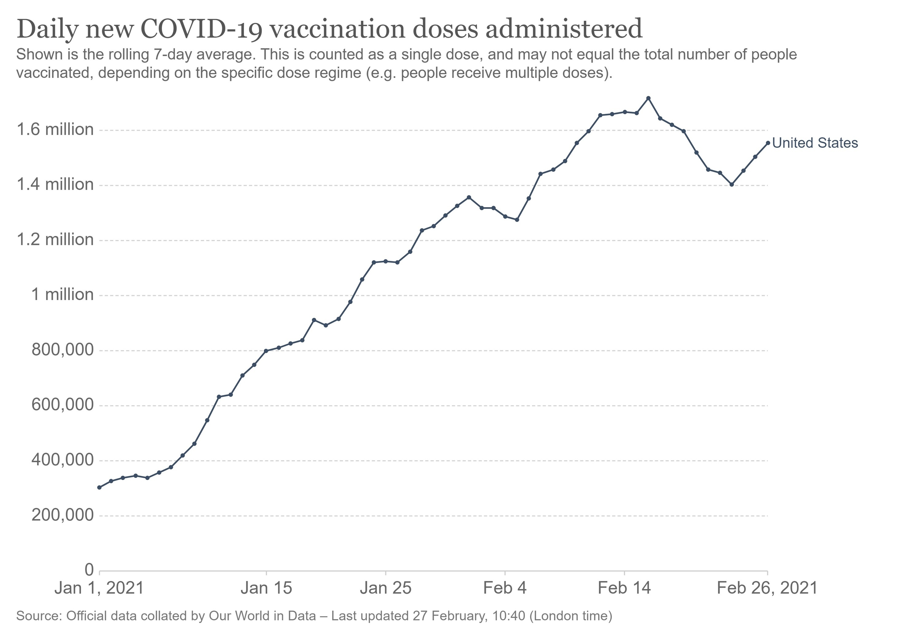

# Covid19 Global Vaccinations & Adverse Reactions

## Motivation:
The novel coronavirus disease (COVID-19)—which emerged in Wuhan, China, in November 2019—has grown into a global threat and was eventually declared a global pandemic. It has seriously impacted the lives of many and caused numerous deaths, caused by the novel SARS-CoV-2 virus. CVR team further examined the effects and benefits of COVID-19 Vaccines globally.  

### Project Description/Outline:
## Definitions

### Assignment of clinical phases
There are five phases of clinical trials: Phase I, Phase I/II, Phase II, Phase II/III, Phase III.

If a vaccine is in a dual phase like `Phase I/II` or in `Phase II/III` it is tested there simultaneously, but for analysis assigned to the higher phase: a vaccine candidate in `Phase I/II`is assigned to `Phase II`, whereas a vaccine candidate tested in `Phase II/III` it is assigned to `Phase III`.

Beyond these dual phases, vaccine candidates can be in different clinical trial phases at the same time (e.g. `Phase I` and `Phase III`) with different trial parameters (age, pre-existing conditions). If that is the case for a candidate, it is shown in both phases.

### Approval
Each country has their own national regulatory authorities (NRA) responsible for approving for new drugs in their country. There are several NRAs that are particularly relevant, among them the US-American [FDA](https://www.fda.gov/vaccines-blood-biologics/industry-biologics/coronavirus-covid-19-cber-regulated-biologics) and the European [EMA](https://www.ema.europa.eu/en/human-regulatory/overview/public-health-threats/coronavirus-disease-covid-19/treatments-vaccines-covid-19). We signify a COVID-19 vaccine as approved if one of these bodies approves a vaccine. 

We will also classify a vaccine as approved if one of these two bodies greenlights a new vaccine on their ["emergency use listing"](https://www.who.int/news-room/q-a-detail/coronavirus-disease-use-of-emergency-use-listing-procedure-forvaccines-against-covid-19), or if the [WHO](https://www.who.int/teams/regulation-prequalification/eul/covid-19) does so. 

### Globally Authorized Vaccines

|         Name              | Vaccine Type | Primary Developer | Country of Origin |
|------------------------------------|------------------------------------|------------------------------------|------------------------------------|
| Comirnaty (BNT162b2)| mRNA-based vaccine | Pfizer, BioNTech; Fosun Pharma | Multinational |
| Convidicea (Ad5-nCoV)| Recombinant vaccine (adenovirus type 5 vector) | CanSino Biologics | China |
| COVID-19 Vaccine AstraZeneca (AZD1222); also known as Covishield| Adenovirus vaccine | BARDA, OWS | UK |
| EpiVacCorona| Peptide vaccine | Federal Budgetary Research Institution State Research Center of Virology and Biotechnology| Russia |
| JNJ-78436735 (formerly Ad26.COV2.S)| Non-replicating viral vector | Janssen Vaccines (Johnson & Johnson) | The Netherlands, US |
| Moderna COVID‑19 Vaccine (mRNA-1273)| mRNA-based vaccine | Moderna, BARDA, NIAID | US |
| Sputnik V | Recombinant adenovirus vaccine (rAd26 and rAd5) | Gamaleya Research Institute, Acellena Contract Drug Research and Development | Russia |

### Limitations + Strengths (VASERS - Vaccine Adverse Event Reporting System)

|         Strengths               | Limitations |
|------------------------------------|------------------------------------|
| National Data | Reporting bias |
| Data available to public | Inconsistent data quality and completeness	|
| Collects information about vaccine, characteristics of patient vaccinated, adverse event | No unvaccindated comparison group |
| VAERS is a tool for identifying potential vaccine safety concerns that need further study using more robust data systems | Cannot calculate how often adverse events occur |
| Rapid signal detection for rease adverse events | Generally cannnot assess if vaccine caused an adverse event	|

### Dataset Ref: COVID19 by Our World in Data
https://github.com/owid/covid-19-data/tree/master/public/data

### Research Questions to Answer:
Track COVID-19 vaccination in the World, answer questions:
* Which country is using what vaccine?
* What country is vaccinated more people?
* Number of people fully vaccinated per country
* What is the vaccine distribution? Are there any decreases in the number of cases in the countries that begin the vaccination process?
    * Are there any correlations between the factors of development indicators and the numbers of vaccinations?
    * After the beginning of the vaccine process all round the world, how does the infection trend move?

### Datasets used but not limited to:
1. Vaccine Adverse Event Reporting System (data DL):	https://vaers.hhs.gov/eSubDownload/verification
2. Vaccine Adverse Event Reporting System (data DL):	https://vaers.hhs.gov/eSubDownload/verification
3. VAERS Data User Guide (Explains the data downloaded):	DEPARTMENT OF HEALTH AND HUMAN SERVICES (hhs.gov)
4. Vaccine Article:	https://www.nature.com/articles/s41597-020-00688-8
5. WHO Data Sets	https://www.who.int/publications/m/item/draft-landscape-of-covid-19-candidate-vaccines

### Rough Breakdown of Tasks:
1. Pulling data, cleaning the data and merging related datasets together
2. Taking the most current data needed for the project
3. Define at what level (ex: Countries, Continent, Manufactors, Patient received doses etc) we want to look 
4. Analyze, plot the data to answer our research questions as applicable
5. Website to present the end product

### Data Analytics Team:
* [Navi Sohi](https://github.com/PlainJane20): `Project Idea`, `Data collection`, `Readme`, `Website design using` using -->`HTML5`/`CSS3`/`Bootstrap`
* [Leonard Zhao](https://github.com/leonardz17): `Leaflet`, `Data to JSON + Boundaries JSON File`, `plotly` 
* [Paola Lopez](https://github.com/paola1395): `Logo`, `Python Flask Initial Set Up`, `D3`, `plotly`
* [Yuying Hong](https://github.com/yuyhong23): `Data cleaning + Convert dataset to sqlite db`,  `zdog library`, `Combine Everyone's Parts Together`
* Team: `Data Organization & Understanding`, `Research Questions`, `Visualization/Graphs Planning`, `Debug/Supports`

